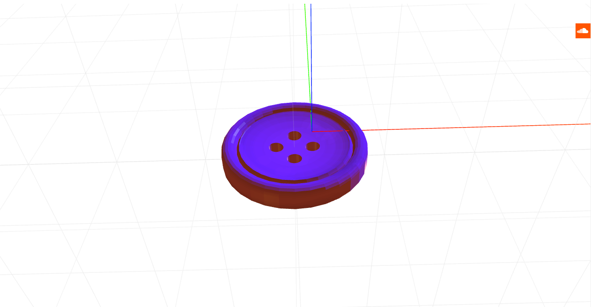

# craft-button

# Install
`$ npm install craft-button`

# Parameters
```sh
radius - determines the radius of the button.
numberOfHoles - decides how many holes the button has.
holeSize - decides the size of the holes.
holeDistance - decides the distance between the holes.
```

# Example
```html
<craft>
	<craft name="button" module="craft-button"/>
	<button></button>
</craft>
```

